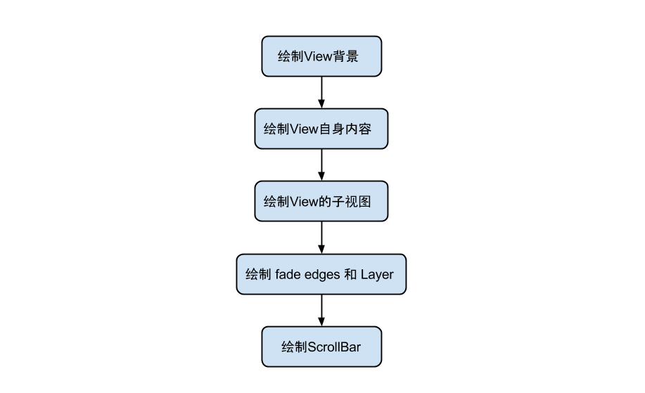

#1.Acivity的生命周期
------


-------
## easy
-onPause,onStop调用时机

-Activity的启动方式 standard, singleTask, singleTop, singleInstance

    standard：标准模式，在当前的任务栈上创建新的Activity，不论之前有没有创建过该Activity。注意：ApplicationContext无法启动standard模式的Activity。

    singleTask：栈内复用模式，分两种情况，第一种情况：如果有任务栈里已经创建了该Acitiviy，直接销毁该Acitivity栈上面的所有Acitivity，无须新创建一个Activity；第二种情况：如果没有任务栈里已经创建该Activity，创建一个新的任务栈并在新栈上创建新Activity。注意：该模式下复用Activity，系统会调用Activity的onNewIntent方法。

    singleTop：栈顶复用模式，如果该Activity在任务栈栈顶，即当前活动的Acitivty就是要创建的Activity，那么不会创建新的Activity。注意：该模式下复用Activity，系统会调用Activity的onNewIntent方法。

    singleInstance：单实例模式，加强版的singleTask，当每次都直接创建一个新的任务栈，再在该新栈上创建新Activity。注意：singleInstance永远是单栈单Activity

## middle
-onSaveInstanceState和onRestoreInstanceState调用的过程和时机

    调用时机：Activity的异常情况下（例如转动屏幕或者被系统回收的情况下），会调用到onSaveInstanceState和onRestoreInstanceState。其他情况不会触发这个过程。但是按Home键或者启动新Activity仍然会单独触发onSaveInstanceState的调用。

    调用过程：旧的Activity要被销毁时，由于是异常情况下的，所以除了正常调用onPause, onStop, onDestroy方法外，还会在调用onStop方法前，调用onSaveInstanceState方法。新的Activity重建时，我们就可以通过onRestoreInstanceState方法取出之前保存的数据并恢复，onRestoreInstanceState的调用时机在onCreate之后。

-onNewIntent的作用和调用时机

    调用时机：如果Activity的启动模式是：singleTop, singleTask, singleInstance，在复用这些Acitivity时就会在调用onStart方法前调用onNewIntent方法
    作用：让已经创建的Activity处理新的Intent。

-Fragment的生命周期

----------


----------
-Activity Fragment生命周期对比

-------


----------


#2.android数据持久化方案，对比优劣

什么是瞬时数据：存储在内存当中，有可能会因为程序的关闭或其他原因导致内存被收回而丢失的数据。<br>
为什么采用数据持久化技术：为了保证关键数据在程序退出时不被丢失。<br>
什么是数据持久化技术：将内存中的瞬时数据保存到存储设备中，保证手机在关机的情况下数据仍然不会丢失<br>

## 文件
Context提供了两个方法来打开数据文件里的文件IO流 FileInputStream openFileInput(String name); FileOutputStream(String name , int mode),这两个方法第一个参数 用于指定文件名，第二个参数指定打开文件的模式<br>
Context还提供了如下几个重要的方法：getDir(String name , int mode):在应用程序的数据文件夹下获取或者创建name对应的子目录;File getFilesDir():获取该应用程序的数据文件夹得绝对路径;String[]fileList():返回该应用数据文件夹的全部文件<br>
----
读写sdcard上的文件,其中读写步骤按如下进行:<br>
1、调用Environment的getExternalStorageState()<br>方法判断手机上是否插了sd卡,且应用程序具有读写SD卡的权限，如下代码将返回true
Environment.getExternalStorageState().equals(Environment.MEDIA_MOUNTED)<br>
2、调用Environment.getExternalStorageDirectory()<br>方法来获取外部存储器，也就是SD卡的目录,或者使用"/mnt/sdcard/"目录<br>
3、使用IO流操作SD卡上的文件<br> 
注意点：手机应该已插入SD卡，对于模拟器而言，可通过mksdcard命令来创建虚拟存储卡,必须在AndroidManifest.xml上配置读写SD卡的权限<br>
android.permission.MOUNT_UNMOUNT_FILESYSTEMS<br>
android.permission.WRITE_EXTERNAL_STORAGE<br>

## SharedPreferences
保存基于XML文件存储的key-value键值对数据，通常用来存储一些简单的配置信息。通过DDMS的File Explorer面板，展开文件浏览树,很明显SharedPreferences数据总是存储在/data/data/package name/shared_prefs目录下。SharedPreferences对象本身只能获取数据而不支持存储和修改,存储修改是通过SharedPreferences.edit()获取的内部接口Editor对象实现<br>

Context.MODE_PRIVATE: 指定该SharedPreferences数据只能被本应用程序读、写<br>
Context.MODE_WORLD_READABLE:指定该SharedPreferences数据能被其他应用程序读，但不能写<br>
Context.MODE_WORLD_WRITEABLE:  指定该SharedPreferences数据能被其他应用程序读，写<br>

commit和apply的区别：<br>
1. commit和apply虽然都是原子性操作，但是原子的操作不同，commit是原子提交到数据库，所以从提交数据到存在Disk中都是同步过程，中间不可打断。<br>
2. 而apply方法的原子操作是原子提交的内存中，而非数据库，所以在提交到内存中时不可打断，之后再异步提交数据到数据库中，因此也不会有相应的返回值。<br>
3. 所有commit提交是同步过程，效率会比apply异步提交的速度慢，但是apply没有返回值，永远无法知道存储是否失败。<br>
4. 在不关心提交结果是否成功的情况下，优先考虑apply方法<br>
## SQLite
SQLiteOpenHelper

## ContentProvider


#3.网络加载失败后重试的代码解决方案

#4.排序算法，分析时间空间复杂度

#5.链表倒置

#6.android事件分发机制

Touch事件相关细节（发生触摸的位置、时间、历史记录、手势动作等）被封装成MotionEvent对象<br>
主要种类：<br>
MotionEvent.ACTION_DOWN：按下View（所有事件的开始）<br>
MotionEvent.ACTION_MOVE：滑动View <br>
MotionEvent.ACTION_CANCEL：非人为原因结束本次事件 <br>
MotionEvent.ACTION_UP：抬起View（与DOWN对应） <br>
----------

----------

```java 
    // ViewGroup
    boolean dispatchTouchEvent(){
        boolean consume = false;
        if(onInterceptTouchEvent()){
            consume = this.onTouchEvent();
        } else {
            consume = child.dispatchTouchEvent();
        }
        return consume;
    }
    // View 
    boolean dispathchTouchEvent(){
        boolean consume = false;
        if(this.onTouchEvent()){
            consume = true;
        }
        return consume;
    }
```
当一个点击事件发生时，调用顺序如下：<br>

1. 事件最先传到Activity的dispatchTouchEvent()进行事件分发
2. 调用Window类实现类PhoneWindow的superDispatchTouchEvent()
3. 调用DecorView的superDispatchTouchEvent()
4. 最终调用DecorView父类的dispatchTouchEvent()，即ViewGroup的dispatchTouchEvent()

onTouch onTouchEvent performClick顺序

#7.View的绘制流程

## View绘制流程函数调用链：<br>
<br>

invalidate() <br>
请求重绘 View 树，即 draw 过程，假如视图发生大小没有变化就不会调用layout()过程，并且只绘制那些调用了invalidate()方法的 View。<br>
requestLayout() <br>
当布局变化的时候，比如方向变化，尺寸的变化，会调用该方法，在自定义的视图中，如果某些情况下希望重新测量尺寸大小，应该手动去调用该方法，它会触发measure()和layout()过程，但不会进行 draw<br>


invalidate() is used specifically for redrawing the content of your view. The redraw does not happen synchronously. Instead, it flags the region of your view as invalid so that it will be redrawn during the next render cycle.<br>

requestLayout() should be used when something within it has possibly changed its dimensions. In this case, the parent view and all other parents up the view hierarchy will need to readjust themselves via a layout pass.<br>

If you are not doing anything to your view that would change its size, then you do not have to call requestLayout.<br>

If you go back and look at the places in the code for TextView where requestLayout is being called, it will be on methods where the view's bounds will be affected. For example, setPadding, setTypeface, setCompoundDrawables, etc.<br>

So, when requestLayout is called, it should be paired with a call to invalidate to ensure that the entire view is redrawn<br>


## MeasureSpecs，测量规格，包含测量要求和尺寸的信息，有三种模式:<br>
UNSPECIFIED:<br>
     父视图不对子视图有任何约束，它可以达到所期望的任意尺寸。比如 ListView、ScrollView，一般自定义 View 中用不到<br>
EXACTLY:<br>
    父视图为子视图指定一个确切的尺寸，而且无论子视图期望多大，它都必须在该指定大小的边界内，对应的属性为 match_parent 或具体值，比如 100dp，父控件可以通过MeasureSpec.getSize(measureSpec)直接得到子控件的尺寸。<br>
AT_MOST:<br>
    父视图为子视图指定一个最大尺寸。子视图必须确保它自己所有子视图可以适应在该尺寸范围内，对应的属性为 wrap_content，这种模式下，父控件无法确定子 View 的尺寸，只能由子控件自己根据需求去计算自己的尺寸，这种模式就是我们自定义视图需要实现测量逻辑的情况<br>
```java
    /**
     * 请求所有子 View 去 measure 自己，要考虑的部分有对子 View 的测绘要求 MeasureSpec 以及其自身的 padding
     * 这里跳过所有为 GONE 状态的子 View，最繁重的工作是在 getChildMeasureSpec 方法中处理的
     *
     * @param widthMeasureSpec  对该 View 的 width 测绘要求
     * @param heightMeasureSpec 对该 View 的 height 测绘要求
     */
    protected void measureChildren(int widthMeasureSpec, int heightMeasureSpec) {
        final int size = mChildrenCount;
        final View[] children = mChildren;
        for (int i = 0; i < size; ++i) {
            final View child = children[i];
            if ((child.mViewFlags & VISIBILITY_MASK) != GONE) {
                measureChild(child, widthMeasureSpec, heightMeasureSpec);
            }
        }
    }

    protected void measureChild(View child, int parentWidthMeasureSpec,
            int parentHeightMeasureSpec) {
        final LayoutParams lp = child.getLayoutParams();//获取 Child 的 LayoutParams

        final int childWidthMeasureSpec = getChildMeasureSpec(parentWidthMeasureSpec,// 获取 ChildView 的 widthMeasureSpec
                mPaddingLeft + mPaddingRight, lp.width);
        final int childHeightMeasureSpec = getChildMeasureSpec(parentHeightMeasureSpec,// 获取 ChildView 的 heightMeasureSpec
                mPaddingTop + mPaddingBottom, lp.height);

        child.measure(childWidthMeasureSpec, childHeightMeasureSpec);
    }

    /** 
     * 该方法是 measureChildren 中最繁重的部分，为每一个 ChildView 计算出自己的 MeasureSpec。
     * 目标是将 ChildView 的 MeasureSpec 和 LayoutParams 结合起来去得到一个最合适的结果。
     *
     * @param spec 对该 View 的测绘要求
     * @param padding 当前 View 在当前唯独上的 paddingand，也有可能含有 margins
     *
     * @param childDimension 在当前维度上（height 或 width）的具体指
     * @return 子视图的 MeasureSpec 
     */
    public static int getChildMeasureSpec(int spec, int padding, int childDimension) {

            .........

        // 根据获取到的子视图的测量要求和大小创建子视图的 MeasureSpec
        return MeasureSpec.makeMeasureSpec(resultSize, resultMode);  
    }

    /**
     *
     * 用于获取 View 最终的大小，父视图提供了宽、高的约束信息
     * 一个 View 的真正的测量工作是在 onMeasure(int, int) 中，由该方法调用。
     * 因此，只有 onMeasure(int, int) 可以而且必须被子类复写
     *
     * @param widthMeasureSpec 在水平方向上，父视图指定的的 Measure 要求
     * @param heightMeasureSpec 在竖直方向上，控件上父视图指定的 Measure 要求
     *
     */
    public final void measure(int widthMeasureSpec, int heightMeasureSpec) {
      ...

      onMeasure(widthMeasureSpec, heightMeasureSpec);

      ...
    }

    protected void onMeasure(int widthMeasureSpec, int heightMeasureSpec) {
        setMeasuredDimension(getDefaultSize(getSuggestedMinimumWidth(), widthMeasureSpec),
                getDefaultSize(getSuggestedMinimumHeight(), heightMeasureSpec));
    }
```

## View绘制过程：<br>
<br>


